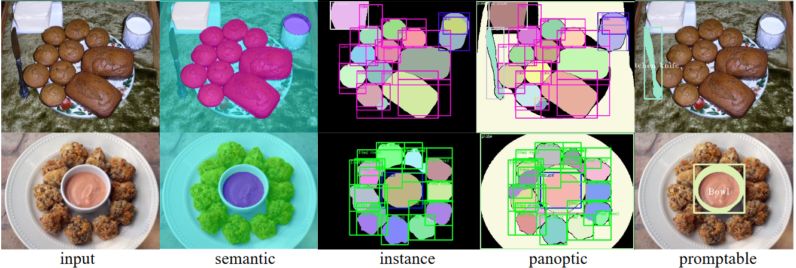

# FoodSAM


SAM demonstrates significant performance on various segmentation benchmarks, showcasing its impressing zero-shot transfer capabilities on 23 diverse segmentation datasets. However, SAM lacks the class-specific information for each mask. To address the above limitation, we propose a novel framework, called FoodSAM. This innovative approach integrates the coarse semantic mask with SAM-generated masks to enhance semantic
segmentation quality. Besides, it can perform instance segmentation on food images. Furthermore, FoodSAM extends its zero-shot capability to encompass panoptic segmentation by incorporating an object detector, which renders FoodSAM to effectively capture non-food object information. Remarkably, this pioneering framework stands as the first-ever work to achieve instance, panoptic, and promptable segmentation on food images. 

[[`Paper`]()] 



FoodSAM contains three basic models: SAM, semantic segmenter, and object detector. SAM generates many class-agnostic binary masks, the semantic segmenter provides food category labels via mask-category match, and the object detector provides the non-food class for background masks. It then enhances the semantic mask via merge strategy and produces instance and panoptic results. Moreover, a seamless prompt-prior selection is integrated into the object detector to achieve promptable segmentation.

  

## Installation
Please follow our [installation.md](installation.md) to install.


## <a name="GettingStarted"></a>Getting Started

You can run the model for semantic segmentation in a few command lines, the panoramic and instance segmentation in FoodSAM/panoramic.py is similar
```
python FoodSAM/semantic.py --img_path <path/to/img> --output <path/to/output> --SAM_checkpoint <path/to/SAM_checkpoint> --semantic_checkpoint <path/to/FoodSeg103_checkpoint> --semantic_config <path/to/FoodSeg103_config>
```
Masks can also be generated for a folder of images by setting `args.data_root and args.img_dir`. Furthermore, by setting `args.eval` to true, the model can output the semantic masks and evaluate the metrics. 

Here are examples of semantic segmentation and instance segmentation on the FoodSeg103 dataset:
```
python FoodSAM/semantic.py --data_root dataset/FoodSeg103/Images --img_dir img_dir/test --ann_dir ann_dir/test --output FoodSAM/semantic_results --SAM_checkpoint  ckpts/sam_vit_l_0b3195.pth --semantic_checkpoint ckpts/SETR_MLA/iter_80000.pth --semantic_config ckpts/SETR_MLA/SETR_MLA_768x768_80k_base.py --eval 
```
```
python FoodSAM/panoptic.py --data_root dataset/FoodSeg103/Images --img_dir img_dir/test --ann_dir ann_dir/test --output FoodSAM/semantic_results --SAM_checkpoint  ckpts/sam_vit_l_0b3195.pth --semantic_checkpoint ckpts/SETR_MLA/iter_80000.pth --semantic_config ckpts/SETR_MLA/SETR_MLA_768x768_80k_base.py --detection_config UNIDET/configs/Unified_learned_OCIM_RS200_6x+2x.yaml --opts MODEL.WEIGHTS ckpts/Unified_learned_OCIM_RS200_6x+2x.pth 
```
The default dataset we use is [FoodSeg103](https://github.com/LARC-CMU-SMU/FoodSeg103-Benchmark-v1), other semantic segmentation food datasets like [UECFOODPIXCOMPLETE](https://mm.cs.uec.ac.jp/uecfoodpix/) can also be used. But you should change the  `args.category_txt and args.num_class`.

## Main Results

### FoodSeg103
| Method | mIou | aAcc | mAcc 
| :-: | :- | -: | :-: |  
|[SETR_MLA(baseline)](https://github.com/LARC-CMU-SMU/FoodSeg103-Benchmark-v1) | 45.10 | 83.53 | 57.44
FoodSAM | 46.42 | 84.10 |  58.27

### UECFOODPIXCOMPLETE


| Method | mIou | aAcc | mAcc 
| :-: | :- | -: | :-: |  
|deeplabV3+ (baseline)| 65.61 |88.20| 77.56
FoodSAM | 66.14 |88.47 |78.01

## License

The model is licensed under the [Apache 2.0 license](LICENSE).

## Citation
If you want to cite our work, please use this:

```
@article

```
